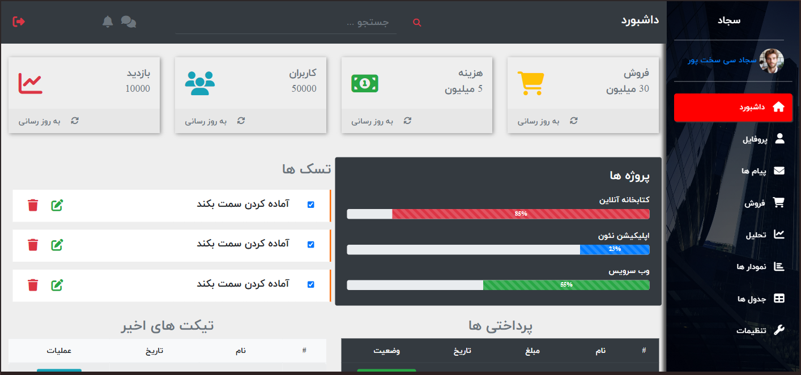
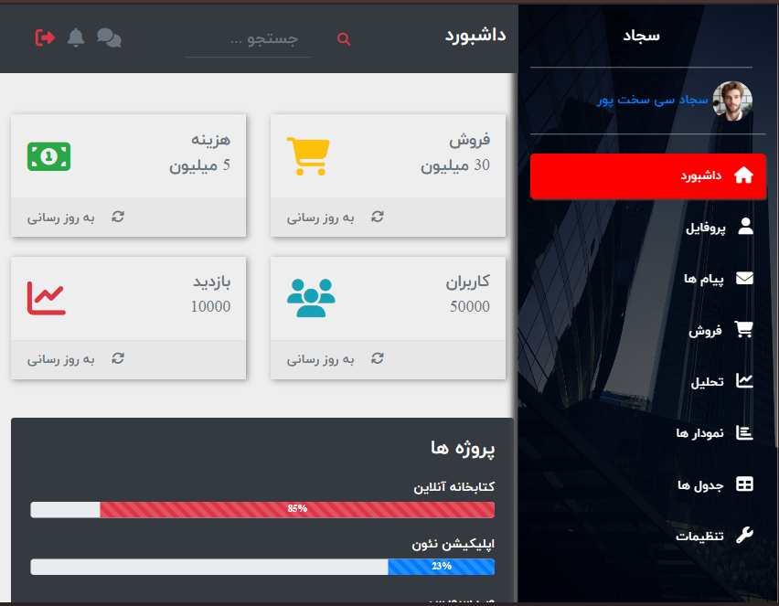
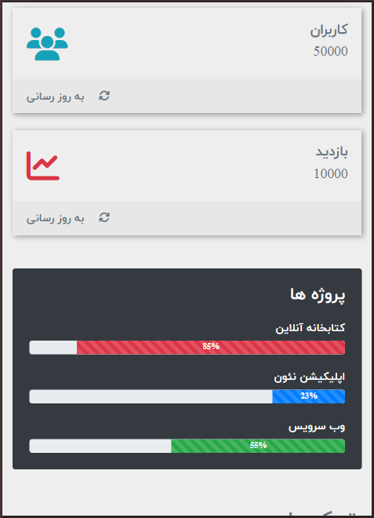

# Dashboard Project

[](LICENSE)
[](https://ir.linkedin.com/in/sajad-sisakht-pour)
[](https://github.com/sajjad-sisakhtpour/dashboard-project/issues)
[](https://github.com/sajjad-sisakhtpour/dashboard-project/stargazers)

## Overview
Dashboard Project is a fully responsive and interactive admin dashboard designed to showcase key statistics and functionalities through a user-friendly interface. It features a navigation menu, various sections for data visualization, and cards displaying vital information, making it a comprehensive tool for data tracking and analysis.

## Table of Contents
- [Prerequisites](#prerequisites)
- [Installation](#installation)
- [Usage](#usage)
- [Screenshots](#screenshots)
- [Examples](#examples)
- [Documentation](#documentation)
- [Contributing](#contributing)
- [License](#license)
- [Contact](#contact)

## Prerequisites
- HTML5 and CSS3
- JavaScript (for interactive elements)
- Bootstrap 4
- FontAwesome (for icons)

## Installation
1. Clone the repository:
    ```bash
    git clone https://github.com/sajjad-sisakhtpour/dashboard-project.git
    ```
2. Navigate to the project directory:
    ```bash
    cd dashboard-project
    ```
3. Open `index.html` in your browser to view the dashboard.

## Usage
This dashboard is designed for web developers and businesses needing an interactive and customizable way to monitor metrics. To customize, update the HTML, CSS, and JavaScript files as needed.

## Screenshots




## Examples
- Track data metrics in real-time.
- Display user activities, notifications, and recent transactions.
- Create and manage tasks efficiently.

## Documentation
### Structure
- `index.html`: Main HTML structure.
- `main.css`: Styles for layout and customization.
- `bootstrap.fa.min.css`: Bootstrap and FontAwesome icons.
- `jquery.slim.min.js`, `popper.min.js`, `bootstrap.min.js`: Scripts for interactivity.

### Features
- **Responsive Design**: Optimized for all screen sizes.
- **User Profile Section**: Personalization with profile display.
- **Sidebar Navigation**: Easy access to different sections.
- **Interactive Cards**: Real-time data updates.
- **Task Management**: Create, update, and track tasks.

## Contributing
Contributions are welcome! Please fork the repository and create a pull request for any improvements.

## License
This project is licensed under the MIT License. See the [LICENSE](LICENSE) file for more information.

## Contact
For any questions, please reach out:
- **Email**: [sajjad.sisakhtpour@gmail.com](mailto:sajjad.sisakhtpour@gmail.com)
- **GitHub**: [sajjad-sisakhtpour](https://github.com/sajjad-sisakhtpour)
- **LinkedIn**: [Sajjad Sisakhtpour](https://ir.linkedin.com/in/sajad-sisakht-pour)

## Live Demo
For a live demonstration, open [here](https://sajjad-sisakhtpour.github.io/dashboard-project) locally in your browser after downloading or cloning the repository.
